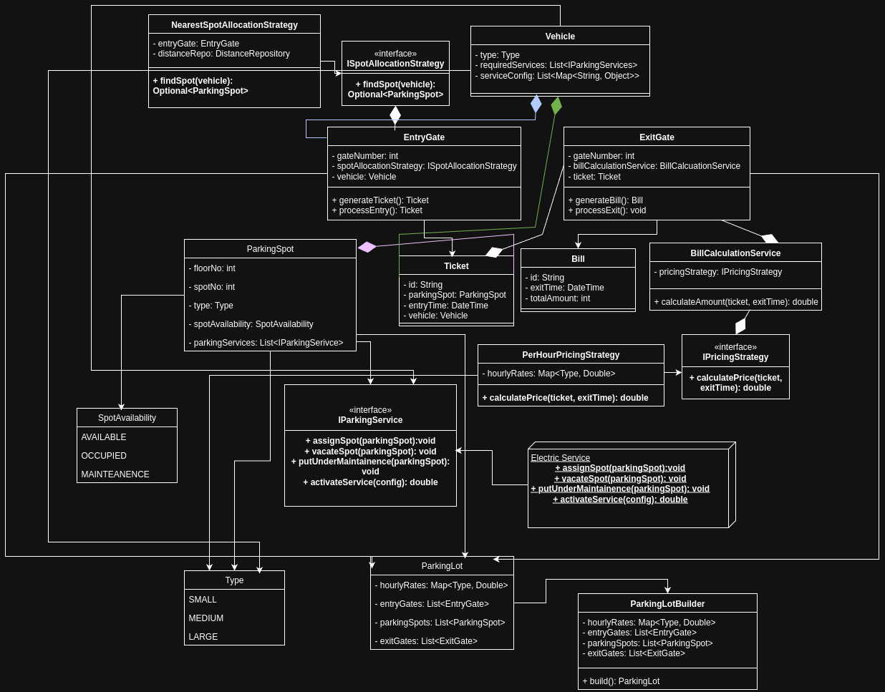

# Parking Lot System

## Overview

This project is an implementation of a **Parking Lot Management System** designed using object-oriented principles and extensible design patterns.
The system supports **entry/exit gates, parking spot allocation, billing, and services (like electric charging)** with strategies for spot allocation and pricing.

The design ensures flexibility by abstracting core behaviors into strategies and services, making it easy to extend the system (e.g., adding new pricing strategies, allocation rules, or spot services).

---

## Features

* 🚗 **Vehicle Handling**: Supports multiple vehicle types (`SMALL`, `MEDIUM`, `LARGE`).
* 🅿️ **Parking Spot Management**: Tracks availability, maintenance, and occupancy status.
* 🎟️ **Ticketing System**: Entry and exit gates issue and process tickets.
* 💳 **Billing System**: Calculates parking charges based on pluggable `PricingStrategy`.
* 🔌 **Additional Services**: Example: `ElectricService` for EV charging.
* 🎯 **Spot Allocation**: Pluggable strategy (`ISpotAllocationStrategy`) for flexible spot assignment.
* 📊 **Extensible Design**: Builder pattern for `ParkingLot`, Strategy pattern for pricing and allocation, and Service abstraction for additional functionality.

---

## Design Highlights

* **TreeSet for Nearest Spot Allocation**
  The `NearestSpotAllocationStrategy` uses a **TreeSet** data structure to efficiently retrieve the nearest available parking spot based on ordering criteria (e.g., floor number, spot number).
  This ensures optimal performance for both lookup and updates.

* **Strategy Pattern**

  * `ISpotAllocationStrategy`: For different parking allocation rules.
  * `PricingStrategy`: For pluggable billing mechanisms (e.g., hourly-based, flat-rate).

* **Builder Pattern**
  `ParkingLotBuilder` allows incremental construction of a `ParkingLot` with gates and strategies.

* **Service Abstraction**
  `ParkingSpotService` and implementations (like `ElectricService`) allow easy addition of future spot services.

---

## Class Diagram

The system was designed based on the following UML class diagram:



---

## How to Run

1. Clone the repository:

   ```bash
   git clone https://github.com/Medha170/ParkingLotLLD.git
   cd parkinglot
   ```

2. Compile and run (example for Java):

   ```bash
   javac -d bin src/**/*.java
   java -cp bin Main
   ```


